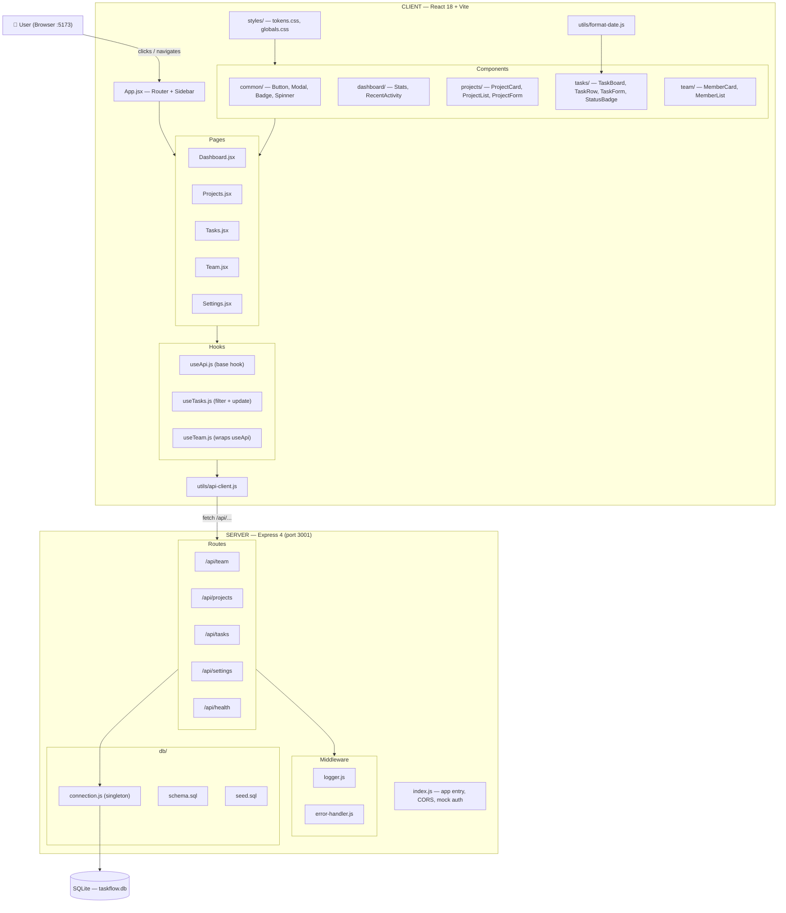
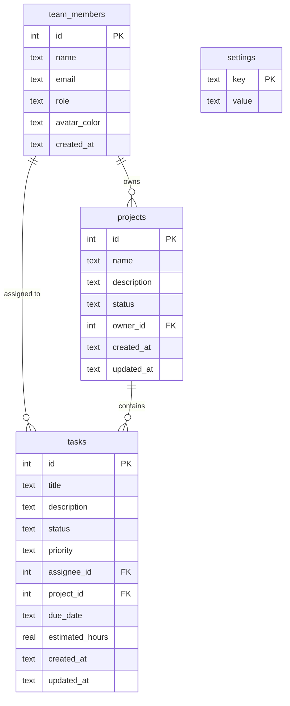

# Architecture Overview — TaskFlow Practice App

> **Generated:** 2026-05-06 via `/explore-codebase` (complete read of all client + server files)
> **Coverage:** Every file in `client/src/`, `server/routes/`, `server/db/`, `server/middleware/`, `tests/`
> **Last updated:** 2026-05-06 15:40 PST

---

## System Architecture



---

## Data Flow — Step by Step

1. User navigates → `App.jsx` React Router renders the matching `<Page>` component
2. Page calls a hook (`useApi`, `useTasks`, `useTeam`) on mount
3. Hook calls `api.get(endpoint)` in `utils/api-client.js`
4. `api-client.js` does `fetch('/api/...')` — proxied by Vite to `localhost:3001`
5. Express routes through `logger.js` middleware → matching route handler
6. Route handler queries SQLite via `db/connection.js` (singleton, WAL mode, foreign keys ON)
7. JSON response flows back: DB → route → `api-client` → hook (`setData`) → React re-render

---

## Database Schema



**Task status values:** `todo` · `in-progress` · `in-review` · `done`
**Task priority values:** `low` · `medium` · `high` · `urgent`
**Project status values:** `active` · `on-hold` · `completed`
**Settings keys (seed):** `app_name` · `theme` · `notifications_enabled` · `default_view`

---

## API Endpoints (Complete)

| Method | Endpoint | What it does |
|--------|----------|-------------|
| GET | `/api/team` | All team members |
| GET | `/api/team/:id` | Single team member |
| **GET** | **`/api/team/:id/tasks`** | **Tasks assigned to a member (workload data — already exists!)** |
| GET | `/api/projects` | All projects (with owner name, task counts) |
| GET | `/api/projects/:id` | Single project with tasks |
| POST | `/api/projects` | Create project |
| PUT | `/api/projects/:id` | Update project |
| DELETE | `/api/projects/:id` | Delete project |
| GET | `/api/tasks` | All tasks (filterable: status, priority, assignee_id, project_id) |
| GET | `/api/tasks/:id` | Single task |
| POST | `/api/tasks` | Create task |
| PUT | `/api/tasks/:id` | Update task |
| DELETE | `/api/tasks/:id` | Delete task |
| GET | `/api/settings` | All settings (key-value) |
| PUT | `/api/settings` | Upsert settings |
| GET | `/api/health` | Health check |

> **Key finding for L4:** `GET /api/team/:id/tasks` already exists in [teams.js](file:///c:/Prasanna/Personal/Education-Technical/CC4PMs/taskflowdemo/server/routes/teams.js). The workload dashboard doesn't need a new API endpoint — it can reuse this one. The build work is frontend only.

---

## Tech Stack

| Layer | Technology | Version | Purpose |
|-------|-----------|---------|---------|
| Frontend framework | React | 18.3.1 | UI component system |
| Routing | React Router DOM | 6.23.1 | Client-side navigation |
| Build tool | Vite | 5.2.13 | Dev server + bundler |
| Backend | Express.js | 4.19.2 | REST API server |
| Database | better-sqlite3 | 11.1.2 | SQLite adapter (synchronous) |
| Test framework | Vitest | 1.6.0 | Unit + integration tests |
| Test utilities | @testing-library/react | 15.0.7 | Component testing helpers |
| Process runner | concurrently | 8.2.2 | Runs client + server together |

---

## UI Components & Design Patterns

### Common components (reusable across all features)

| Component | File | What it does | Use in L3/L4 |
|-----------|------|-------------|-------------|
| `Button` | [Button.jsx](file:///c:/Prasanna/Personal/Education-Technical/CC4PMs/taskflowdemo/client/src/components/common/Button.jsx) | Primary/secondary/ghost variants | Use for all actions |
| `Modal` | [Modal.jsx](file:///c:/Prasanna/Personal/Education-Technical/CC4PMs/taskflowdemo/client/src/components/common/Modal.jsx) | Dialog overlay — `isOpen` + `onClose` + `title` props | Use for forms |
| `Badge` | [Badge.jsx](file:///c:/Prasanna/Personal/Education-Technical/CC4PMs/taskflowdemo/client/src/components/common/Badge.jsx) | Maps status/priority string → colored tag | Reuse for task status in workload |
| `Spinner` | [Spinner.jsx](file:///c:/Prasanna/Personal/Education-Technical/CC4PMs/taskflowdemo/client/src/components/common/Spinner.jsx) | Loading state — used in every page | Use in workload dashboard |

### Feature components

| Component | Area | Key pattern |
|-----------|------|------------|
| `Stats.jsx` | Dashboard | Card grid layout — **reusable pattern for workload stats** |
| `RecentActivity.jsx` | Dashboard | Feed list pattern |
| `ProjectCard/List/Form` | Projects | Card + modal form pattern |
| `TaskBoard` | Tasks | Column-based board view (kanban) |
| `TaskRow` | Tasks | Grid row layout with Badge usage |
| `TaskForm` | Tasks | Controlled form — captures title, status, priority, assignee, project, due_date, estimated_hours |
| `MemberCard` | Team | Avatar initials from name, role + email — **extend this for workload data** |
| `MemberList` | Team | Grid layout — reuse for workload dashboard |

### Design token system ([tokens.css](file:///c:/Prasanna/Personal/Education-Technical/CC4PMs/taskflowdemo/client/src/styles/tokens.css))

| Category | Key tokens |
|----------|-----------|
| Brand | `--color-primary: #e63f02` · `--color-accent: #fcc403` |
| Neutrals | `--color-bg: #fafafa` · `--color-surface: #fff` · `--color-text: #111827` |
| Status | `--color-success: #10b981` · `--color-error: #ef4444` · `--color-warning: #f59e0b` |
| Typography | `--font-size-xs/sm/base/lg/xl/2xl/3xl` · `--font-weight-normal/medium/semibold` |
| Spacing | `--space-1` through `--space-8` (4px increments) |

**Rule:** Never use hardcoded color values — always reference a CSS token.

---

## Key Files Reference

| File | What it does |
|------|-------------|
| [App.jsx](file:///c:/Prasanna/Personal/Education-Technical/CC4PMs/taskflowdemo/client/src/App.jsx) | Root — sidebar nav + all route definitions. Contains Bug #1 (L33: `/setting` typo) |
| [utils/api-client.js](file:///c:/Prasanna/Personal/Education-Technical/CC4PMs/taskflowdemo/client/src/utils/api-client.js) | Centralized fetch wrapper (GET/POST/PUT/DELETE) |
| [utils/format-date.js](file:///c:/Prasanna/Personal/Education-Technical/CC4PMs/taskflowdemo/client/src/utils/format-date.js) | `formatDate`, `formatRelativeDate`, `isOverdue` — use these in workload dashboard |
| [hooks/useApi.js](file:///c:/Prasanna/Personal/Education-Technical/CC4PMs/taskflowdemo/client/src/hooks/useApi.js) | Base hook — loading/error/data + `refetch`. Used by `useTeam`. |
| [hooks/useTasks.js](file:///c:/Prasanna/Personal/Education-Technical/CC4PMs/taskflowdemo/client/src/hooks/useTasks.js) | Extended hook — filter query string + `updateTask` with optimistic state |
| [server/index.js](file:///c:/Prasanna/Personal/Education-Technical/CC4PMs/taskflowdemo/server/index.js) | Express entry — CORS, middleware, all route mounts, hardcoded mock auth |
| [server/db/connection.js](file:///c:/Prasanna/Personal/Education-Technical/CC4PMs/taskflowdemo/server/db/connection.js) | Singleton DB — auto-runs schema + seed on first connection |
| [server/db/schema.sql](file:///c:/Prasanna/Personal/Education-Technical/CC4PMs/taskflowdemo/server/db/schema.sql) | 4 tables: team_members, projects, tasks, settings |
| [server/db/seed.sql](file:///c:/Prasanna/Personal/Education-Technical/CC4PMs/taskflowdemo/server/db/seed.sql) | 7 members, 4 projects, 40+ tasks. **Rachel (ID 3) is intentionally overloaded** |
| [server/routes/teams.js](file:///c:/Prasanna/Personal/Education-Technical/CC4PMs/taskflowdemo/server/routes/teams.js) | Team API — includes `GET /api/team/:id/tasks` for per-member task lists |

---

## Test Coverage

| Test file | What it covers | Gap |
|-----------|---------------|-----|
| `tests/api/projects.test.js` | Projects CRUD | Missing: GET all, GET single, DELETE |
| `tests/api/tasks.test.js` | GET all tasks | Missing: POST, PUT, DELETE, filters |
| `tests/components/TaskRow.test.jsx` | TaskRow renders | Missing: all other components |
| *(none)* | Team, Settings APIs | Completely untested |
| *(none)* | Dashboard, Projects, Tasks, Team, Settings pages | Completely untested |

> Test gaps are intentional — these are the areas you'll work on in L3 (Contribute).

---

## Development Workflow

```bash
npm run install:all   # Install root + client + server (run once)
npm run dev           # Start both: Vite :5173 + Express :3001
npm run test          # Run Vitest test suite
npm run db:reset      # Wipe taskflow.db and re-seed from schema.sql + seed.sql
```

---

## Known Issues

| ID | File | Issue |
|----|------|-------|
| Bug #1 | [App.jsx L33](file:///c:/Prasanna/Personal/Education-Technical/CC4PMs/taskflowdemo/client/src/App.jsx) | `NavLink to="/setting"` (singular) but Route is `path="/settings"` (plural) — one-char typo |
| Bug #2 | [Team.jsx](file:///c:/Prasanna/Personal/Education-Technical/CC4PMs/taskflowdemo/client/src/pages/Team.jsx) | No workload data displayed — workload dashboard to be built in L4 |
| Bug #3 | [Team.jsx L14](file:///c:/Prasanna/Personal/Education-Technical/CC4PMs/taskflowdemo/client/src/pages/Team.jsx) | Copy: "product team members" should be "project team members" |

> **Cross-reference:** [docs/bug-tracker.md](file:///c:/Prasanna/Personal/Education-Technical/CC4PMs/taskflowdemo/docs/bug-tracker.md)
