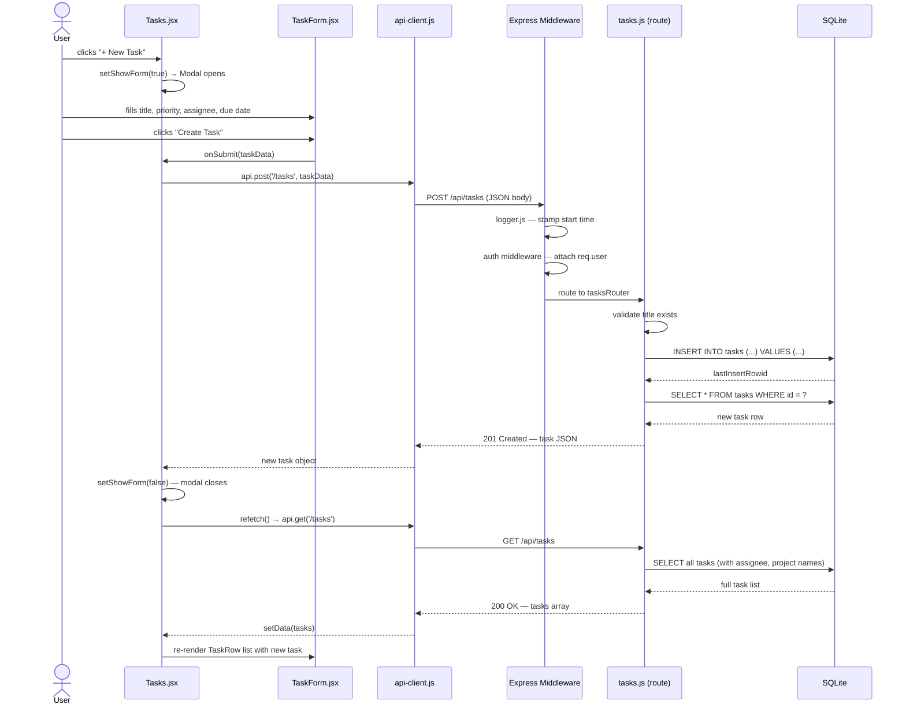

# Task Creation Flow — End to End

> **Traced:** 2026-05-06 via full source read
> **Flow:** User clicks "+ New Task" → task appears in the list
> **Files involved:** 6 files across 4 layers

---

## Sequence Diagram

---

## Step-by-Step Walkthrough

| Step | File | What happens | What's passed |
|------|------|-------------|---------------|
| 1 | [Tasks.jsx](file:///c:/Prasanna/Personal/Education-Technical/CC4PMs/taskflowdemo/client/src/pages/Tasks.jsx) | `setShowForm(true)` — Modal + TaskForm renders | — |
| 2 | [TaskForm.jsx](file:///c:/Prasanna/Personal/Education-Technical/CC4PMs/taskflowdemo/client/src/components/tasks/TaskForm.jsx) | `handleSubmit` fires → calls `onSubmit(taskData)` | `{ title, description, status, priority, assignee_id, project_id, due_date, estimated_hours }` |
| 3 | [Tasks.jsx](file:///c:/Prasanna/Personal/Education-Technical/CC4PMs/taskflowdemo/client/src/pages/Tasks.jsx) | `handleCreate` receives data → calls `api.post('/tasks', taskData)` | taskData object |
| 4 | [api-client.js](file:///c:/Prasanna/Personal/Education-Technical/CC4PMs/taskflowdemo/client/src/utils/api-client.js) | `fetch('POST /api/tasks')` with JSON body | HTTP request → localhost:3001 |
| 5 | [logger.js](file:///c:/Prasanna/Personal/Education-Technical/CC4PMs/taskflowdemo/server/middleware/logger.js) | Stamps request start time | — |
| 6 | [server/index.js](file:///c:/Prasanna/Personal/Education-Technical/CC4PMs/taskflowdemo/server/index.js) | Auth middleware attaches `req.user` | hardcoded PM user |
| 7 | [tasks.js (route)](file:///c:/Prasanna/Personal/Education-Technical/CC4PMs/taskflowdemo/server/routes/tasks.js) | Validates `title` → SQL INSERT → SELECT new row | SQL params |
| 8 | SQLite | Writes row, returns `lastInsertRowid` | new task id |
| 9 | [tasks.js (route)](file:///c:/Prasanna/Personal/Education-Technical/CC4PMs/taskflowdemo/server/routes/tasks.js) | Returns `201 Created` with full task JSON | task object |
| 10 | [api-client.js](file:///c:/Prasanna/Personal/Education-Technical/CC4PMs/taskflowdemo/client/src/utils/api-client.js) | Parses response → returns to `handleCreate` | task object |
| 11 | [Tasks.jsx](file:///c:/Prasanna/Personal/Education-Technical/CC4PMs/taskflowdemo/client/src/pages/Tasks.jsx) | `setShowForm(false)` closes modal → `refetch()` fires | — |
| 12 | [useTasks.js](file:///c:/Prasanna/Personal/Education-Technical/CC4PMs/taskflowdemo/client/src/hooks/useTasks.js) | `GET /api/tasks` → `setData(tasks)` | full task array |
| 13 | [TaskRow.jsx](file:///c:/Prasanna/Personal/Education-Technical/CC4PMs/taskflowdemo/client/src/components/tasks/TaskRow.jsx) | Re-renders with new task included | — |

---

## What This Means for Bug Reports

**Symptom:** "I submitted the task form, the modal closed, but the task never showed up in the list."

| Without flow trace | With flow trace |
|-------------------|----------------|
| "Task creation is broken" | "Modal closed = Steps 1-10 worked (form submitted, POST succeeded). Task not appearing = problem is in Step 11-13: `refetch()` call or `useTasks` not updating. Check `GET /api/tasks` response in the browser network tab." |

The modal closing is diagnostic evidence. It proves the POST returned successfully. The bug is downstream — in the refresh path, not the creation path.

---

## Validation Layers

There are **two** validation points in this flow — most people assume there's one:

1. **Frontend (TaskForm.jsx):** `required` attribute on the title input — browser blocks submit if empty
2. **Backend (tasks.js route):** `if (!title) return res.status(400)` — server rejects requests without a title even if the frontend check is bypassed

This matters: if a user calls the API directly (or if the frontend check breaks), the server still catches it.

---

> **Full architecture reference:** [docs/architecture-overview.md](file:///c:/Prasanna/Personal/Education-Technical/CC4PMs/taskflowdemo/docs/architecture-overview.md)
> **Bug tracker:** [docs/bug-tracker.md](file:///c:/Prasanna/Personal/Education-Technical/CC4PMs/taskflowdemo/docs/bug-tracker.md)
